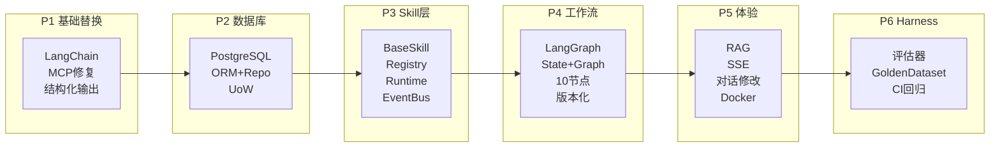
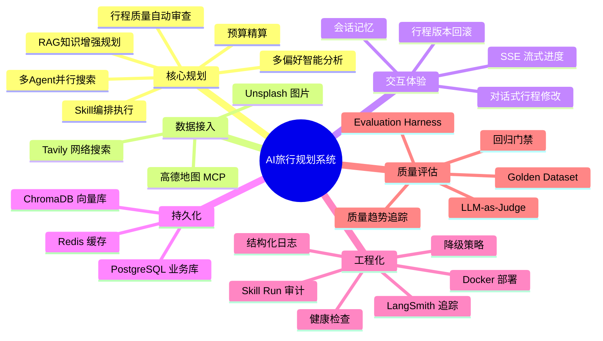
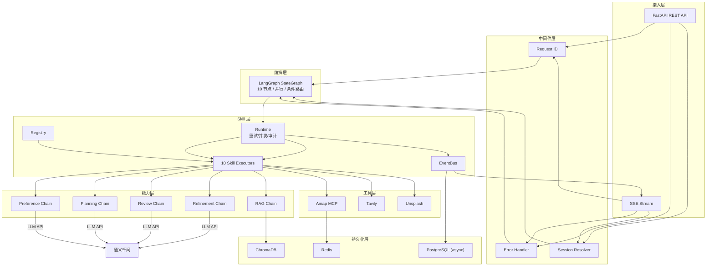

# AI 智能旅行规划系统 — 技术设计与实施总纲

> **版本**：v2.1-patch-final  
> **更新日期**：2026-04-10  
> **定位**：本文档是项目唯一的主文档，整合了 **技术设计规格 + 可行性自检 + 详细任务拆分**，覆盖从当前 V1.0 原型到 V2.1 生产级系统的完整演进路径。

---

# 第一部分：可行性自检

## 1.1 当前代码基线盘点

> [!IMPORTANT]
> 项目不会一次性重写。以下盘点标记了每个文件的"保留/修改/替换"策略，确保改造过程中系统始终可运行。

| # | 文件 | 行数 | 当前状态 | 改造策略 |
|---|------|------|---------|---------|
| 1 | `app/api/main.py` | 110 | FastAPI 入口 ✅ | **保留**，增加 lifespan / middleware |
| 2 | `app/api/routes/trip.py` | 87 | POST `/api/trip/plan` ✅ | **保留**，Phase 4 替换内部实现 |
| 3 | `app/api/routes/poi.py` | 130 | POI 路由 ✅ | **保留**，异步化 |
| 4 | `app/api/routes/map.py` | ~100 | 地图路由 ✅ | **保留** |
| 5 | `app/agents/trip_planner_agent.py` | 505 | hello_agents SimpleAgent ❌ | **Phase 1 重写** |
| 6 | `app/services/llm_service.py` | 38 | HelloAgentsLLM 单例 ❌ | **Phase 1 替换** |
| 7 | `app/services/amap_service.py` | 270 | MCP 同步 + 4 个 `return []` ❌ | **Phase 1 修复** |
| 8 | `app/services/unsplash_service.py` | 87 | 同步 requests ⚠️ | **Phase 5 异步化** |
| 9 | `app/models/schemas.py` | 207 | Pydantic 数据模型 ✅ | **保留**，扩展新模型 |
| 10 | `app/config.py` | 112 | pydantic-settings ✅ | **每 Phase 增加配置项** |
| 11 | `requirement.txt` | 29 | hello-agents + fastapi ⚠️ | **Phase 1 替换依赖** |
| 12 | `frontend/src/views/` | 2 文件 | Vue 3 ✅ | **Phase 5 增加 SSE 支持** |

**小结**：核心框架（FastAPI / Pydantic / Vue 3）全部可保留，需替换的仅是 AI 框架层（hello_agents → LangChain）和数据层（无 → PostgreSQL）。

---

## 1.2 风险评估矩阵

| # | 风险 | 级别 | 影响 | 缓解措施 | 阻断 Phase |
|---|------|------|------|---------|-----------|
| R1 | hello_agents → LangChain 替换失败 | 🔴 高 | 核心功能瘫痪 | 先建独立 `llm_service_v2.py` 验证可用再替换 | P1 |
| R2 | MCP 同步 → 异步改造困难 | 🟡 中 | 阻塞 FastAPI 事件循环 | Phase 1 用 `asyncio.to_thread()` 过渡 | P1 |
| R3 | PostgreSQL + Docker Windows 配置复杂 | 🟡 中 | 开发环境受阻 | 用 Docker Desktop for Windows | P2 |
| R4 | BGE Embedding 下载慢 / 模型大 | 🟡 中 | RAG 无法启动 | Phase 5 再接入，不阻塞核心 | P5 |
| R5 | LangGraph 学习成本 | 🟡 中 | Phase 4 延期 | 先用 2-3 节点简单图验证，再扩展 | P4 |
| R6 | 前端 SSE 改造 | 🟢 低 | 用户体验 | 后端先做 SSE，前端可独立改 | P5 |
| R7 | LLM Judge 评分不稳定 | 🟢 低 | Harness 不可靠 | Phase 6 先用确定性评估器，LLM Judge 逐步校准 | P6 |
| R8 | 通义千问 API 兼容性 | 🟢 低 | ChatOpenAI 报错 | `.env` 已有 `LLM_BASE_URL`，兼容 OpenAI 格式 | P1 |

---

## 1.3 可行性结论

> [!IMPORTANT]
> **方案可行。** 最大风险（R1）通过"先验证再替换"可控。整个改造按 6 Phase 推进，**每个 Phase 结束后系统都是可运行的完整系统**。

---

## 1.4 全局依赖关系



---

# 第二部分：技术设计规格

## 2.1 项目概述

基于 **LangChain + LangGraph + RAG + MCP + Skills + PostgreSQL + Evaluation Harness** 构建的多智能体智能旅行规划系统。用户输入目的地城市、旅行天数和个人偏好后，系统通过多个 AI Agent / Skill 并行协作——实时检索高德地图数据、查询天气、搜索酒店，并结合本地旅行知识库（RAG）——自动生成合理、个性化的行程方案。

---

## 2.2 V1.0 → V2.1 对比

| 对比项 | V1.0 现状 | V2.1 目标 |
|--------|----------|-----------|
| Agent 框架 | hello_agents SimpleAgent | LangChain + LangGraph |
| 能力组织 | 代码内聚合调用 | Skill Registry + Runtime + Manifest |
| 执行方式 | 4 步串行 | 并行 + 条件路由 + 并发控制 |
| 知识来源 | LLM 训练数据 | RAG 本地知识库 |
| 输出解析 | 手写 JSON 解析 | PydanticOutputParser + OutputFixingParser |
| 会话管理 | 无持久化 | PostgreSQL (async) + Redis |
| 行程修改 | 不支持 | 对话式修改 + 行程版本化 + 乐观锁 |
| 质量保障 | 无 | 8 项指标自动审查 + 迭代优化 |
| 可观测性 | print() | LangSmith + loguru + skill_runs + 健康检查 |
| 质量评估 | 无 | Evaluation Harness + Golden Dataset + CI 回归门禁 |
| 部署方式 | 本地 python run.py | Docker Compose |
| 故障应对 | 无 | 分级降级策略 |

---

## 2.3 十一大功能模块



| 模块 | 功能描述 | 解决的问题 |
|------|---------|-----------| 
| **F1 偏好分析引擎** | 多偏好标签 + 自由文本解析为结构化搜索策略 | 当前只取 `preferences[0]` |
| **F2 RAG 知识库** | 城市美食 / 景点 / 季节信息向量化，规划时检索注入 | LLM 可能编造信息 |
| **F3 多 Agent 工作流** | LangGraph 状态图：并行搜索、条件路由、迭代优化 | 串行慢、无质量审查 |
| **F4 MCP 工具层** | MCP Client 管理多 Server + 统一工具适配 + 解析 | MCP 返回未结构化 |
| **F5 结构化输出** | PydanticOutputParser + OutputFixingParser | 手写 JSON 解析不稳定 |
| **F6 流式响应** | SSE 推送步骤进度 / LLM Token / 最终结果 | 同步阻塞无反馈 |
| **F7 对话式修改** | 基于会话记忆修改行程 | 不可持续编辑 |
| **F8 可观测性** | LangSmith + loguru + Request ID + 健康检查 | 排障困难 |
| **F9 Skill Registry & Runtime** | 注册、发现、依赖注入、并发控制、审计 | Agent 节点耦合，复用困难 |
| **F10 业务持久化** | PostgreSQL async + UoW + 乐观锁 + 保留策略 | 无法持久化/回滚/审计 |
| **F11 Evaluation Harness** | Golden Dataset + 三层评估器 + 回归检测 + CI | 行程质量无法度量 |

---

## 2.4 完整技术栈

| 层级 | 技术 | 版本 | 用途 |
|------|------|------|------|
| Web 框架 | FastAPI | ≥0.115 | 异步 REST API + SSE |
| ASGI | Uvicorn / Gunicorn | ≥0.32 | 开发/生产 |
| AI 编排 | LangChain | ≥0.3 | Chain / Prompt / Parser / Memory |
| 工作流 | LangGraph | ≥0.3 | StateGraph 多 Agent |
| Skill 层 | 自定义 Runtime | - | 注册 / 注入 / 执行 / 审计 |
| LLM 接口 | langchain-openai | ≥0.3 | ChatOpenAI → 通义千问 |
| 业务 DB | PostgreSQL | ≥16 | 用户/会话/行程/版本/反馈/审计/评估 |
| ORM | SQLAlchemy 2.x (async) + asyncpg | ≥2.0 | 异步不阻塞事件循环 |
| Migration | Alembic | ≥1.13 | Schema 版本管理 |
| 缓存 | Redis | 7 | MCP 缓存、短会话缓存 |
| 向量库 | ChromaDB | ≥0.6 | RAG |
| Embedding | sentence-transformers (BGE) | ≥3.0 | 中文语义 |
| MCP | fastmcp + mcp SDK | ≥2.0 | Client/Server |
| Evaluation | 自定义 Harness + LangSmith | - | 离线评估 / 回归 / LLM Judge |
| 日志 | LangSmith + loguru | - | 追踪 + 结构化日志 |
| 数据校验 | Pydantic | ≥2.0 | Schema / DTO |
| 容器 | Docker + docker-compose | - | 编排 |
| 前端 | Vue 3 + Ant Design Vue | - | 交互界面 |

**技术选型决策记录**：

| 决策点 | 选择 | 排除方案 | 理由 |
|--------|------|---------|------|
| 业务 DB | PostgreSQL | MySQL / SQLite | JSONB + 事务 + 扩展性 |
| ORM | SQLAlchemy async + asyncpg | 原生 SQL / 同步 | 不阻塞 FastAPI 事件循环 |
| Skill 组织 | Registry + Runtime + Manifest | 直接写入 Graph Node | 复用性 + 可测试性 |
| 向量库 | ChromaDB | pgvector | 保留原有方案，降低迁移成本 |
| 事件分发 | 进程内 EventBus | Kafka / RabbitMQ | 单实例场景轻量高效 |
| 并发控制 | 乐观锁 | 悲观锁 | 旅行场景冲突概率低 |
| 评估框架 | 自定义 + LangSmith | DeepEval / RAGAS | 旅行场景深度定制 |

---

## 2.5 分层架构



---

## 2.6 Skill 层设计

### 2.6.1 Skill 清单

| Skill | 输入 | 输出 | 说明 |
|-------|------|------|------|
| `analyze_preferences_skill` | preferences / free_text / days | PreferenceStrategy | 多偏好解析 |
| `search_attractions_skill` | city / themes / constraints | list[POIInfo] | 景点搜索 |
| `query_weather_skill` | city / date_range | list[WeatherInfo] | 天气查询 |
| `search_hotels_skill` | city / budget / style | list[HotelInfo] | 酒店搜索 |
| `retrieve_knowledge_skill` | city / themes | rag_context | RAG 检索 |
| `generate_itinerary_skill` | all above data | TripPlan | 行程生成 |
| `review_itinerary_skill` | TripPlan / constraints | QualityReview | 质量审查 |
| `refine_itinerary_skill` | TripPlan / issues / instruction | TripPlan | 修复/修改 |
| `estimate_budget_skill` | TripPlan / pricing | Budget | 预算计算 |
| `content_enrichment_skill` | TripPlan / city | EnrichedTripPlan | 图片+贴士 |

### 2.6.2 基础接口

```python
# app/skills/base.py

class SkillManifest(BaseModel):
    name: str
    version: str
    description: str
    timeout_seconds: int = 30
    max_retries: int = 2
    tags: list[str] = []
    dependencies: list[str] = []

@dataclass
class SkillContext:
    request_id: str
    session_id: str
    user_id: str | None
    llm: ChatOpenAI
    mcp_client: MCPClientManager
    rag_retriever: BaseRetriever | None
    db_session: AsyncSession
    redis: Redis
    emit: Callable[[StreamEvent], Awaitable[None]]
    run_skill: Callable[[str, SkillInput], Awaitable[SkillOutput]]

@dataclass
class BaseSkill(ABC):
    manifest: SkillManifest

    @abstractmethod
    async def execute(self, data: SkillInput, ctx: SkillContext) -> SkillOutput: ...
    async def pre_execute(self, ctx: SkillContext) -> None: pass
    async def post_execute(self, result: SkillOutput, ctx: SkillContext) -> SkillOutput: return result
    async def on_error(self, error: Exception, ctx: SkillContext) -> SkillOutput | None: return None
    async def validate_input(self, data: SkillInput) -> None: pass
```

### 2.6.3 Runtime 责任链

```
输入校验 → 并发控制(Semaphore) → pre_execute → execute(重试+超时) → post_execute → 审计(skill_runs) → 事件(EventBus)
```

### 2.6.4 EventBus

```python
class EventBus:
    def on(self, event_type: str, handler: Callable): ...
    async def emit(self, event): ...
    # 注册: event_bus.on("SkillCompletedEvent", sse_handler)
    # 注册: event_bus.on("SkillCompletedEvent", logging_handler)
```

### 2.6.5 测试策略

| 层级 | 方式 | Mock 范围 | 目标 |
|------|------|----------|------|
| Unit | pytest + Mock SkillContext | 全 Mock | I/O 转换逻辑 |
| Integration | TestContainer PG | LLM/MCP Mock | skill_runs 写入 |
| Contract | 固定 MCP 响应快照 | LLM Mock | MCP 解析逻辑 |
| E2E | 真实 LLM + MCP | 无 Mock | CI 可选 |

---

## 2.7 数据库设计

### 2.7.1 核心业务表（7 张）

| 表 | 主要字段 | 关键索引 |
|----|---------|---------|
| `users` | id(PK), nickname, preferences_json(jsonb), settings_json(jsonb), created_at, updated_at | - |
| `chat_sessions` | id(PK), user_id(FK→users), title, city, status, deleted_at | - |
| `chat_messages` | id(PK), session_id(FK), role, content, metadata(jsonb) | `(session_id, created_at)` |
| `trip_plans` | id(PK), session_id(FK), current_version(int), title, status, deleted_at | `(session_id)` |
| `trip_plan_versions` | id(PK), trip_plan_id(FK), version_no, plan_json(jsonb), source | `(trip_plan_id, version_no)` UNIQUE |
| `trip_feedback` | id(PK), trip_plan_id(FK), rating(1-5), comment | - |
| `skill_runs` | id(PK), request_id, session_id(FK), trip_plan_id(FK), skill_name, status, latency_ms, token_usage | `(session_id, created_at)`, `(skill_name, status)` |

### 2.7.2 评估表（3 张）

| 表 | 主要字段 | 关键索引 |
|----|---------|---------|
| `eval_datasets` | id(PK), name(UNIQUE), version, case_count, tags(jsonb) | - |
| `eval_runs` | id(PK), run_id, dataset_id(FK), case_id, structural/constraint/quality/trajectory_score, composite_score, passed, git_commit | `(run_id)`, `(dataset_id, created_at)`, `(case_id, created_at)` |
| `eval_baselines` | id(PK), name, run_id, dataset_id(FK), avg_composite_score, is_active | - |

### 2.7.3 异步引擎 + UoW

```python
# app/db/session.py
engine = create_async_engine("postgresql+asyncpg://...", pool_size=10, max_overflow=20)
AsyncSessionLocal = async_sessionmaker(engine, expire_on_commit=False)

# app/db/unit_of_work.py
class UnitOfWork:
    async def __aenter__(self): ...   # 创建 session + repos
    async def __aexit__(self, ...): ...  # commit 或 rollback
    
# 乐观锁示例:
# UPDATE trip_plans SET current_version=N+1 WHERE current_version=N
```

### 2.7.4 数据保留策略

| 表 | 保留周期 | 清理方式 |
|----|---------|---------|
| `skill_runs` | 90 天 | 归档后删除 |
| `chat_messages` | 180 天 | 软删除 |
| `trip_plan_versions`（非 current） | 90 天 | 物理删除 |
| `eval_runs` | 180 天 | 物理删除 |
| `users` / `chat_sessions` / `trip_plans` | 永久 | 仅软删除 |

---

## 2.8 LangGraph 工作流

### 2.8.1 节点 → Skill 映射

| 节点 | Skill | 并发 |
|------|-------|------|
| N1 偏好分析 | `analyze_preferences_skill` | 单独 |
| N2 知识检索 | `retrieve_knowledge_skill` | 单独 |
| N3 景点搜索 | `search_attractions_skill` | 并行 ↓ |
| N4 天气查询 | `query_weather_skill` | 并行 ↓ |
| N5 酒店搜索 | `search_hotels_skill` | 并行 ↓ |
| N6 行程编排 | `generate_itinerary_skill` | 单独 |
| N7 质量审查 | `review_itinerary_skill` | 单独 |
| N8 预算计算 | `estimate_budget_skill` | 单独 |
| N9 行程修复 | `refine_itinerary_skill` | 条件触发 |
| N10 内容丰富 | `content_enrichment_skill` | 单独 |

### 2.8.2 State 定义

```python
class TripPlannerState(TypedDict):
    """纯运行时状态 — 不含持久化 ID"""
    request: TripRequest
    session_id: str
    user_id: str | None
    preference_strategy: dict
    rag_context: str
    attractions: list[dict]
    weather: list[dict]
    hotels: list[dict]
    trip_plan: Optional[TripPlan]
    quality_score: float
    quality_issues: list[str]
    iteration_count: int
    budget: Optional[Budget]
    error: Optional[str]
    current_step: Optional[str]
```

---

## 2.9 Evaluation Harness (F11)

### 2.9.1 三层评估器

| 层级 | 评估器 | 类型 | 成本 |
|------|--------|------|------|
| L1 | StructuralEvaluator | 确定性：天数/字段/坐标/预算 | 零 |
| L2 | ConstraintEvaluator | 确定性+RAG：闭馆/时长/天气 | 低 |
| L3 | QualityJudgeEvaluator | LLM-as-Judge：5 维主观评分 | 中 |
| L3b | TrajectoryEvaluator | 确定性：Skill 覆盖率/耗时/Token | 零 |

### 2.9.2 加权综合评分

```
composite = structural×0.25 + constraint×0.30 + quality_judge×0.35 + trajectory×0.10
```

### 2.9.3 回归分级

| 级别 | delta 范围 | CI 行为 |
|------|-----------|---------|
| none | ≥ 0 | 通过 |
| minor | (-0.05, 0) | 通过，打 warning |
| major | [-0.15, -0.05] | 阻断合并 |
| critical | < -0.15 | 阻断合并 + 告警 |

### 2.9.4 Golden Dataset 格式

```yaml
cases:
  - id: bp_001
    name: "3天北京历史文化之旅"
    input:
      city: "北京"
      travel_days: 3
      preferences: ["历史文化", "美食"]
    expectations:
      structural: { days_count: 3, has_budget: true }
      constraints: { no_closed_day_conflicts: true }
      quality: { preference_alignment: 4, overall: 3.5 }
```

---

## 2.10 降级策略

| 组件故障 | 降级策略 | 影响 |
|---------|---------|------|
| PostgreSQL | 回退 Redis-only（不持久化） | 重启丢失会话 |
| Redis | 跳过缓存，直接查源 | 响应变慢 |
| ChromaDB | 跳过 RAG，`rag_context = ""` | 质量下降 |
| LLM API | 使用 fallback 模板行程 | 无个性化 |
| MCP Server | 使用 Redis 缓存旧数据 | 数据过时 |

---

## 2.11 完整代码框架

```text
backend/
├── run.py
├── requirements.txt
├── .env
├── Dockerfile
├── docker-compose.yml
├── alembic.ini
│
├── data/
│   ├── knowledge_base/          # RAG 知识
│   └── eval/                    # 评估数据集
│       ├── core/
│       ├── regression/
│       └── city_specific/
│
├── app/
│   ├── config.py
│   ├── api/
│   │   ├── main.py
│   │   ├── dependencies.py
│   │   ├── middleware/
│   │   │   ├── request_id.py
│   │   │   └── error_handler.py
│   │   └── routes/
│   │       ├── trip.py          # V1 兼容
│   │       ├── chat.py          # V2 SSE
│   │       ├── session.py       # V2 会话
│   │       ├── poi.py
│   │       ├── map.py
│   │       └── health.py
│   │
│   ├── graph/
│   │   ├── state.py
│   │   ├── nodes.py
│   │   ├── edges.py
│   │   └── trip_graph.py
│   │
│   ├── skills/
│   │   ├── base.py
│   │   ├── registry.py
│   │   ├── runtime.py
│   │   ├── events.py
│   │   ├── manifests/           # 10 个 YAML
│   │   ├── analyze_preferences/
│   │   ├── search_attractions/
│   │   ├── query_weather/
│   │   ├── search_hotels/
│   │   ├── retrieve_knowledge/
│   │   ├── generate_itinerary/
│   │   ├── review_itinerary/
│   │   ├── refine_itinerary/
│   │   ├── estimate_budget/
│   │   └── content_enrichment/
│   │
│   ├── chains/
│   │   ├── preference_chain.py
│   │   ├── planning_chain.py
│   │   ├── review_chain.py
│   │   ├── refinement_chain.py
│   │   └── rag_chain.py
│   │
│   ├── rag/
│   │   ├── embeddings.py
│   │   ├── document_loader.py
│   │   ├── text_splitter.py
│   │   ├── vector_store.py
│   │   ├── retriever.py
│   │   └── indexer.py
│   │
│   ├── mcp/
│   │   ├── client.py
│   │   ├── parsers.py
│   │   └── adapters/
│   │
│   ├── db/
│   │   ├── base.py
│   │   ├── session.py
│   │   ├── unit_of_work.py
│   │   ├── models/              # 10 个 ORM 模型
│   │   ├── repositories/        # 9 个 Repo
│   │   └── migrations/
│   │
│   ├── memory/
│   │   ├── conversation.py
│   │   ├── cache.py
│   │   └── persistence.py
│   │
│   ├── harness/
│   │   ├── runner.py
│   │   ├── regression.py
│   │   ├── report.py
│   │   ├── loader.py
│   │   ├── models.py
│   │   ├── evaluators/
│   │   │   ├── base.py
│   │   │   ├── structural.py
│   │   │   ├── constraint.py
│   │   │   ├── quality_judge.py
│   │   │   └── trajectory.py
│   │   └── cli.py
│   │
│   ├── models/
│   │   └── schemas.py
│   │
│   ├── services/
│   │   ├── llm_service.py
│   │   ├── amap_service.py
│   │   └── unsplash_service.py
│   │
│   └── observability/
│       ├── logging.py
│       └── tracing.py
│
└── tests/
    ├── test_llm.py
    ├── test_eval_gate.py
    └── ...
```

---

# 第三部分：详细任务拆分

> [!IMPORTANT]
> **阅读指引**：每个 Task 包含 **操作**（具体做什么）、**文件**（动哪些文件）、**代码要点**（关键实现）、**验证**（怎么确认做对了）、**预估**（耗时）、**依赖**（前置任务）。所有 Task 按 Phase → Sprint → Task 三级组织。

---

## Phase 1：基础替换（3 天，15 个 Task）

> **目标**：底层从 hello_agents 替换为 LangChain，修复所有 MCP TODO，行程生成成功率 ≥ 90%
> 
> **约束**：API 接口不变、前端不改、不加新功能
> 
> **交付物**：`POST /api/trip/plan` 可工作，底层已用 LangChain，MCP 返回真实数据

---

### Sprint 1.1：依赖与环境

#### `[ ]` Task 1.1.1 — 更新 Python 依赖

| 项 | 值 |
|----|----|
| **文件** | `backend/requirement.txt` |
| **操作** | 删除 `hello-agents`，添加 `langchain>=0.3.0`、`langchain-openai>=0.3.0`、`langchain-community>=0.3.0`、`langgraph>=0.3.0` |
| **代码** | `pip install -r requirement.txt` |
| **验证** | 安装无报错；`python -c "import langchain; print(langchain.__version__)"` 输出 ≥ 0.3 |
| **预估** | 15 分钟 |
| **依赖** | 无 |

#### `[ ]` Task 1.1.2 — 更新环境变量

| 项 | 值 |
|----|----|
| **文件** | `backend/.env` |
| **操作** | 添加 LangChain 需要的环境变量（不删除现有变量，保持向后兼容） |
| **代码** | 新增 `OPENAI_API_KEY`、`OPENAI_BASE_URL`、`OPENAI_MODEL`（复用现有通义千问凭证）。可选：`LANGSMITH_API_KEY`、`LANGSMITH_TRACING=false` |
| **验证** | `.env` 文件格式正确，无语法错误 |
| **预估** | 10 分钟 |
| **依赖** | 无 |

#### `[ ]` Task 1.1.3 — 扩展 Settings 配置类

| 项 | 值 |
|----|----|
| **文件** | `backend/app/config.py` |
| **操作** | 在 Settings 类中添加：`openai_api_key`、`openai_base_url`、`openai_model`、`langsmith_tracing`。保留旧的 `llm_model_id` 等字段不删除。 |
| **代码要点** | 使用 `model_validator` 添加一个校验器，确保新旧配置至少有一套可用 |
| **验证** | `python -c "from app.config import get_settings; s=get_settings(); print(s.openai_model)"` |
| **预估** | 15 分钟 |
| **依赖** | Task 1.1.2 |

---

### Sprint 1.2：LLM 服务替换

#### `[ ]` Task 1.2.1 — 创建新 LLM 服务（共存模式）

| 项 | 值 |
|----|----|
| **文件** | **新建** `backend/app/services/llm_service_v2.py` |
| **操作** | 创建三个工厂函数，基于 ChatOpenAI + 通义千问兼容 API |
| **代码要点** | |

```python
# app/services/llm_service_v2.py
from langchain_openai import ChatOpenAI
from app.config import get_settings

def get_chat_llm(
    model: str | None = None,
    temperature: float = 0.7,
    max_tokens: int = 4096,
) -> ChatOpenAI:
    settings = get_settings()
    return ChatOpenAI(
        model=model or settings.openai_model,
        api_key=settings.openai_api_key,
        base_url=settings.openai_base_url,
        temperature=temperature,
        max_tokens=max_tokens,
    )

def get_light_llm() -> ChatOpenAI:
    """轻量模型（偏好分析、质量审查等非核心任务）"""
    return get_chat_llm(model="qwen-turbo", temperature=0.3, max_tokens=2048)

def get_heavy_llm() -> ChatOpenAI:
    """重型模型（行程生成）"""
    return get_chat_llm(temperature=0.7, max_tokens=8192)
```

| **验证** | 运行 Task 1.2.2 的连通性测试 |
| **预估** | 30 分钟 |
| **依赖** | Task 1.1.3 |

> [!WARNING]
> 此步是 **R1 风险验证点**。如果 ChatOpenAI + 通义千问不兼容，需在此排查。不要跳过 Task 1.2.2。

#### `[ ]` Task 1.2.2 — LLM 连通性验证

| 项 | 值 |
|----|----|
| **文件** | **新建** `backend/tests/test_llm_connectivity.py` |
| **操作** | 编写一个手动执行的测试脚本 |
| **代码要点** | |

```python
# tests/test_llm_connectivity.py
import asyncio
from app.services.llm_service_v2 import get_chat_llm, get_light_llm

async def test():
    # 1. 基础连通
    llm = get_chat_llm()
    resp = await llm.ainvoke("你好，请用一句话介绍北京")
    print(f"✅ 基础连通: {resp.content[:50]}...")

    # 2. 流式可用
    llm2 = get_chat_llm()
    chunks = []
    async for chunk in llm2.astream("用3个词描述上海"):
        chunks.append(chunk.content)
    print(f"✅ 流式可用: {''.join(chunks)}")

    # 3. 轻量模型可用
    light = get_light_llm()
    resp2 = await light.ainvoke("1+1等于多少？")
    print(f"✅ 轻量模型: {resp2.content}")

asyncio.run(test())
```

| **验证** | `python tests/test_llm_connectivity.py` 三个 ✅ 全部通过 |
| **预估** | 20 分钟 |
| **依赖** | Task 1.2.1 |

---

### Sprint 1.3：MCP 数据解析修复

#### `[ ]` Task 1.3.1 — 创建 MCP 数据解析器

| 项 | 值 |
|----|----|
| **文件** | **新建** `backend/app/mcp/parsers.py` |
| **操作** | 创建 4 个解析函数，将 MCP 返回的原始字符串转为 Pydantic 模型 |
| **代码要点** | |

```python
# app/mcp/parsers.py
import json
import re
from typing import Optional
from app.models.schemas import POIInfo, WeatherInfo

def parse_poi_result(raw: str) -> list[dict]:
    """解析高德 POI 搜索返回的原始文本"""
    try:
        # MCP 返回可能是 JSON 字符串或自然语言
        # 尝试直接解析 JSON
        data = json.loads(raw)
        if isinstance(data, list):
            return data
        if isinstance(data, dict) and "pois" in data:
            return data["pois"]
    except json.JSONDecodeError:
        pass
    
    # 正则解析 fallback
    # ... 根据实际 MCP 返回格式补充
    return []

def parse_weather_result(raw: str) -> list[dict]:
    """解析天气查询返回"""
    # ... 类似逻辑
    pass

def parse_route_result(raw: str) -> dict:
    """解析路线规划返回"""
    pass

def parse_hotel_result(raw: str) -> list[dict]:
    """解析酒店搜索返回"""
    pass
```

| **验证** | 用 `amap_service.py` 实际调用产生的原始返回值作为输入，确认解析结果非空 |
| **预估** | 2 小时 |
| **依赖** | 无（可与 Sprint 1.2 并行） |
| **注意** | 此步需要先手动触发一次 MCP 调用，打印原始返回，确定实际格式再写解析逻辑 |

#### `[ ]` Task 1.3.2 — 修复 amap_service.py 的 4 个 TODO

| 项 | 值 |
|----|----|
| **文件** | `backend/app/services/amap_service.py` |
| **操作** | 将 4 个 `return []` / `return {}` 替换为调用 `parsers.py` 的解析函数 |
| **具体位置** | |

| 方法 | 原行为 | 修复为 |
|------|--------|--------|
| `search_poi()` ~L87 | `return []` | `return parse_poi_result(result)` |
| `get_weather()` ~L116 | `return []` | `return parse_weather_result(result)` |
| `plan_route()` ~L182 | `return {}` | `return parse_route_result(result)` |
| `geocode()` ~L213 | `return None` | 解析经纬度字符串 |

| **验证** | 每个方法调用后返回非空结果 |
| **预估** | 1 小时 |
| **依赖** | Task 1.3.1 |

#### `[ ]` Task 1.3.3 — MCP 异步过渡包装

| 项 | 值 |
|----|----|
| **文件** | `backend/app/services/amap_service.py` |
| **操作** | 将同步的 `mcp_tool.run(args)` 包装为 `await asyncio.to_thread(mcp_tool.run, args)` |
| **代码要点** | 在文件顶部 `import asyncio`，每个 MCP 调用点改为异步 |
| **验证** | 在 async 上下文中调用不阻塞，`print` 不显示 "blocking" 警告 |
| **预估** | 30 分钟 |
| **依赖** | Task 1.3.2 |

---

### Sprint 1.4：Prompt 模板化

#### `[ ]` Task 1.4.1 — 将 Prompt 字符串迁移为 ChatPromptTemplate

| 项 | 值 |
|----|----|
| **文件** | **新建** `backend/app/agents/prompts/` 目录，包含 `__init__.py` + `templates.py` |
| **操作** | 将 `trip_planner_agent.py` 第 15-154 行的 4 个 Prompt 常量字符串转为 LangChain `ChatPromptTemplate` |
| **迁移映射** | |

| 原常量名 | 新模板名 | 输入变量 |
|---------|---------|---------|
| `ATTRACTION_AGENT_PROMPT` | `attraction_search_template` | `{city}`, `{themes}`, `{constraints}` |
| `WEATHER_AGENT_PROMPT` | `weather_query_template` | `{city}`, `{date_range}` |
| `HOTEL_AGENT_PROMPT` | `hotel_search_template` | `{city}`, `{budget_level}`, `{style}` |
| `PLANNER_AGENT_PROMPT` | `planning_template` | `{city}`, `{days}`, `{attractions}`, `{weather}`, `{hotels}`, `{preferences}`, `{format_instructions}` |

| **代码要点** | 使用 `SystemMessagePromptTemplate` + `HumanMessagePromptTemplate` 拆分系统指令和用户输入 |
| **验证** | 每个模板 `.format_messages(...)` 不报错，输出包含预期变量 |
| **预估** | 1 小时 |
| **依赖** | Task 1.2.1 |

#### `[ ]` Task 1.4.2 — 添加 Few-shot 输出示例

| 项 | 值 |
|----|----|
| **文件** | **新建** `backend/app/agents/prompts/few_shots.py` |
| **操作** | 为 `planning_template` 创建 1 个完整 JSON 输出示例 |
| **代码要点** | 示例应严格符合 `TripPlan` 的 Pydantic Schema，包含至少 1 天的完整行程 |
| **验证** | `TripPlan.model_validate_json(example_json)` 不报错 |
| **预估** | 30 分钟 |
| **依赖** | Task 1.4.1 |

---

### Sprint 1.5：结构化输出

#### `[ ]` Task 1.5.1 — 创建行程生成 Chain

| 项 | 值 |
|----|----|
| **文件** | **新建** `backend/app/chains/planning_chain.py` |
| **操作** | 使用 Prompt + LLM + PydanticOutputParser 组成 Chain |
| **代码要点** | |

```python
# app/chains/planning_chain.py
from langchain.output_parsers import PydanticOutputParser
from langchain.output_parsers import OutputFixingParser
from app.models.schemas import TripPlan
from app.agents.prompts.templates import planning_template
from app.services.llm_service_v2 import get_heavy_llm

def create_planning_chain():
    llm = get_heavy_llm()
    parser = PydanticOutputParser(pydantic_object=TripPlan)
    fixing_parser = OutputFixingParser.from_llm(parser=parser, llm=llm)
    
    prompt = planning_template.partial(
        format_instructions=parser.get_format_instructions()
    )
    
    chain = prompt | llm | fixing_parser
    return chain
```

| **验证** | `chain.ainvoke({...固定输入...})` 返回 `TripPlan` 对象 |
| **预估** | 1.5 小时 |
| **依赖** | Task 1.4.1 + Task 1.2.1 |

#### `[ ]` Task 1.5.2 — 创建偏好分析 Chain

| 项 | 值 |
|----|----|
| **文件** | **新建** `backend/app/chains/preference_chain.py` |
| **操作** | 创建轻量 Chain，输出 `PreferenceStrategy` Pydantic 模型 |
| **代码要点** | |

```python
# 新增 Pydantic 模型（在 schemas.py 或独立文件）
class PreferenceStrategy(BaseModel):
    day_themes: list[str]          # 每天的主题，如 ["历史", "文化", "美食"]
    search_keywords: list[str]     # 搜索关键词
    constraints: list[str]         # 约束条件
    budget_level: str              # high / medium / low
    pace: str                      # relaxed / moderate / intensive
```

| **验证** | `preference_chain.ainvoke({"preferences": ["历史", "美食"], "days": 3})` 返回 PreferenceStrategy |
| **预估** | 1 小时 |
| **依赖** | Task 1.5.1 |

---

### Sprint 1.6：新 Agent 集成

#### `[ ]` Task 1.6.1 — 重写 trip_planner_agent.py

| 项 | 值 |
|----|----|
| **文件** | `backend/app/agents/trip_planner_agent.py` |
| **操作** | 完整重写 `MultiAgentTripPlanner` 类，删除所有 `SimpleAgent` 引用 |
| **新流程** | |

```
1. preference_chain.ainvoke(偏好) → PreferenceStrategy
2. 并行调用:
   - amap_service.search_poi(城市, 关键词) → 景点列表
   - amap_service.get_weather(城市, 日期) → 天气列表
   - amap_service.search_hotels(城市) → 酒店列表（如有方法）
3. planning_chain.ainvoke(所有数据) → TripPlan
```

| **关键约束** | `plan_trip(request: TripRequest) -> TripPlan` 接口签名不变，前端和路由层无需修改 |
| **验证** | Task 1.6.3 的端到端验证 |
| **预估** | 2 小时 |
| **依赖** | Task 1.5.1 + Task 1.3.2 |

#### `[ ]` Task 1.6.2 — 清理旧依赖

| 项 | 值 |
|----|----|
| **文件** | `backend/requirement.txt`、全项目搜索 |
| **操作** | 从 `requirement.txt` 删除 `hello-agents`。`grep -r "hello_agents" app/` 确认无残留引用。如有，替换或删除。 |
| **验证** | `pip install -r requirement.txt && python run.py` 启动成功 |
| **预估** | 15 分钟 |
| **依赖** | Task 1.6.1 |

#### `[ ]` Task 1.6.3 — Phase 1 端到端验证

| 项 | 值 |
|----|----|
| **操作** | 手动测试完整链路 |
| **验证清单** | |

- [ ] `POST /api/trip/plan` 发送 3 天北京请求，返回 200 + 行程 JSON
- [ ] 行程天数 = 3
- [ ] 每天有 ≥ 2 个景点，景点名称是真实的（非虚构）
- [ ] 每天有早/中/晚三餐推荐
- [ ] 包含天气数据（非空）
- [ ] 包含酒店推荐（至少 1 个）
- [ ] 包含预算估算
- [ ] 景点有经纬度坐标（非 0,0）
- [ ] 连续调用 3 次，成功率 ≥ 2/3
- [ ] 前端 `http://localhost:5173` 展示行程正常（地图标点、时间线）
- [ ] 无 `hello_agents` 相关的 import error

| **预估** | 30 分钟 |
| **依赖** | Task 1.6.2 |

---

## Phase 2：数据库底座（3 天，14 个 Task）

> **目标**：PostgreSQL 异步持久化能力就绪，10 张表可用
> 
> **约束**：Phase 1 的 API 接口保持不动，DB 层建好但不接入业务
> 
> **交付物**：`/health` 返回 DB 连接状态，alembic upgrade head 创建所有表

---

### Sprint 2.1：Docker + 依赖

#### `[ ]` Task 2.1.1 — 创建 docker-compose.yml

| 项 | 值 |
|----|----|
| **文件** | **新建** `backend/docker-compose.yml` |
| **操作** | 定义 PostgreSQL 16 + Redis 7 服务 |
| **代码要点** | |

```yaml
version: "3.9"
services:
  postgres:
    image: postgres:16-alpine
    environment:
      POSTGRES_USER: travel
      POSTGRES_PASSWORD: travel_secret
      POSTGRES_DB: travel_planner
    ports: ["5432:5432"]
    volumes: ["pgdata:/var/lib/postgresql/data"]

  redis:
    image: redis:7-alpine
    ports: ["6379:6379"]
    volumes: ["redisdata:/data"]

volumes:
  pgdata:
  redisdata:
```

| **验证** | `docker-compose up -d`，然后 `docker exec -it <pg> psql -U travel travel_planner` 进入 |
| **前提** | Docker Desktop for Windows 已安装 |
| **预估** | 30 分钟 |
| **依赖** | Phase 1 完成 |

#### `[ ]` Task 2.1.2 — 添加 DB 相关 Python 依赖

| 项 | 值 |
|----|----|
| **文件** | `backend/requirement.txt` |
| **新增** | `sqlalchemy[asyncio]>=2.0`、`asyncpg>=0.29`、`alembic>=1.13`、`redis>=5.0` |
| **验证** | `pip install -r requirement.txt` 无报错 |
| **预估** | 10 分钟 |
| **依赖** | Task 2.1.1 |

#### `[ ]` Task 2.1.3 — 扩展 Settings（DB 配置）

| 项 | 值 |
|----|----|
| **文件** | `backend/app/config.py`、`backend/.env` |
| **新增配置项** | `DATABASE_URL`、`DB_POOL_SIZE=10`、`DB_MAX_OVERFLOW=20`、`DB_POOL_RECYCLE=3600`、`REDIS_URL=redis://localhost:6379/0` |
| **验证** | `get_settings().database_url` 返回正确连接字符串 |
| **预估** | 20 分钟 |
| **依赖** | Task 2.1.2 |

---

### Sprint 2.2：ORM 模型

#### `[ ]` Task 2.2.1 — 创建 DB 基础设施

| 项 | 值 |
|----|----|
| **文件** | **新建** `app/db/__init__.py`、`app/db/base.py`、`app/db/session.py` |
| **代码要点** | |

```python
# app/db/base.py
from sqlalchemy.orm import DeclarativeBase
class Base(DeclarativeBase):
    pass

# app/db/session.py
from sqlalchemy.ext.asyncio import create_async_engine, async_sessionmaker
engine = create_async_engine(settings.database_url, pool_size=settings.db_pool_size, ...)
AsyncSessionLocal = async_sessionmaker(engine, expire_on_commit=False)
```

| **预估** | 30 分钟 |
| **依赖** | Task 2.1.3 |

#### `[ ]` Task 2.2.2 — 创建 7 个业务 ORM 模型

| 项 | 值 |
|----|----|
| **文件** | **新建** `app/db/models/` 目录，包含 `user.py`、`chat_session.py`、`chat_message.py`、`trip_plan.py`、`trip_plan_version.py`、`trip_feedback.py`、`skill_run.py` |
| **操作** | 按 §2.7.1 表设计，定义每个 ORM 模型的 Column、Index、FK |
| **每个文件约** | 30-50 行 |
| **验证** | `from app.db.models.user import User` 不报错 |
| **预估** | 2 小时 |
| **依赖** | Task 2.2.1 |

#### `[ ]` Task 2.2.3 — 创建 3 个评估 ORM 模型

| 项 | 值 |
|----|----|
| **文件** | **新建** `app/db/models/eval_dataset.py`、`eval_run.py`、`eval_baseline.py` |
| **操作** | 按 §2.7.2 表设计，定义 ORM 模型 |
| **验证** | import 不报错 |
| **预估** | 45 分钟 |
| **依赖** | Task 2.2.1 |

#### `[ ]` Task 2.2.4 — 初始化 Alembic 并生成首次迁移

| 项 | 值 |
|----|----|
| **操作步骤** | |

```bash
cd backend
alembic init app/db/migrations
# 修改 alembic.ini: sqlalchemy.url = 使用环境变量
# 修改 env.py: 支持 async + 导入所有模型
alembic revision --autogenerate -m "initial_10_tables"
alembic upgrade head
```

| **验证** | `psql` 中 `\dt` 显示 10 张表 |
| **预估** | 1 小时 |
| **依赖** | Task 2.2.2 + Task 2.2.3 |

---

### Sprint 2.3：Repository 层

#### `[ ]` Task 2.3.1 — 创建 BaseRepository

| 项 | 值 |
|----|----|
| **文件** | **新建** `app/db/repositories/base_repo.py` |
| **代码要点** | 泛型基类，提供 `create()`、`get_by_id()`、`list()`、`update()`、`soft_delete()` |

```python
class BaseRepository(Generic[T]):
    def __init__(self, session: AsyncSession, model: type[T]):
        self.session = session
        self.model = model
    
    async def get_by_id(self, id: uuid.UUID) -> T | None:
        return await self.session.get(self.model, id)
    
    async def create(self, **kwargs) -> T:
        obj = self.model(**kwargs)
        self.session.add(obj)
        await self.session.flush()
        return obj
```

| **预估** | 30 分钟 |
| **依赖** | Task 2.2.4 |

#### `[ ]` Task 2.3.2 — 创建 7 个业务 Repository

| 项 | 值 |
|----|----|
| **文件** | **新建** `app/db/repositories/` 下 7 个文件 |
| **业务方法** | |

| Repo | 特殊方法 |
|------|---------|
| `user_repo.py` | `get_or_create_anonymous(session_token)` |
| `session_repo.py` | `get_active_sessions(user_id, limit)` |
| `message_repo.py` | `get_session_messages(session_id, limit, before)` |
| `trip_plan_repo.py` | `increment_version(plan_id, expected_version)` — 乐观锁 |
| `version_repo.py` | `get_version(plan_id, version_no)`, `get_latest(plan_id)` |
| `feedback_repo.py` | 标准 CRUD |
| `skill_run_repo.py` | `get_by_session(session_id)`, `get_by_skill_name(name, limit)` |

| **预估** | 3 小时 |
| **依赖** | Task 2.3.1 |

---

### Sprint 2.4：UoW + 集成 + 验证

#### `[ ]` Task 2.4.1 — 创建 UnitOfWork

| 项 | 值 |
|----|----|
| **文件** | **新建** `app/db/unit_of_work.py` |
| **代码要点** | `async with UnitOfWork() as uow: ...` 事务模式（参考 §2.7.3） |
| **预估** | 30 分钟 |
| **依赖** | Task 2.3.2 |

#### `[ ]` Task 2.4.2 — 创建 FastAPI 依赖注入

| 项 | 值 |
|----|----|
| **文件** | **新建** `app/api/dependencies.py` |
| **代码要点** | `get_db_session()`, `get_uow()` 作为 FastAPI `Depends` |
| **预估** | 20 分钟 |
| **依赖** | Task 2.4.1 |

#### `[ ]` Task 2.4.3 — 创建增强版健康检查

| 项 | 值 |
|----|----|
| **文件** | **新建** `app/api/routes/health.py` |
| **代码要点** | `/health` 端点检查 PostgreSQL + Redis 连接 |
| **预估** | 30 分钟 |
| **依赖** | Task 2.4.2 |

#### `[ ]` Task 2.4.4 — FastAPI lifespan 集成

| 项 | 值 |
|----|----|
| **文件** | `app/api/main.py` |
| **操作** | 添加 `@asynccontextmanager async def lifespan(app)` 管理 DB engine / Redis 连接的启动和关闭。注册 health 路由。 |
| **预估** | 30 分钟 |
| **依赖** | Task 2.4.3 |

#### `[ ]` Task 2.4.5 — Phase 2 端到端验证

| **验证清单** | |
|------|------|

- [ ] `docker-compose up -d` 启动 PG + Redis 无报错
- [ ] `alembic upgrade head` 创建 10 张表
- [ ] `psql` 中 `\dt` 显示所有表
- [ ] `GET /health` 返回 `{"status":"healthy", "postgresql":"ok", "redis":"ok"}`
- [ ] Phase 1 的 `POST /api/trip/plan` 仍正常工作（未受 DB 影响）
- [ ] 每个 Repo 至少有 1 个手动测试：创建 + 查询成功

| **预估** | 30 分钟 |

---

## Phase 3：Skill 层抽象（4 天，12 个 Task）

> **目标**：4 个核心 Skill 可独立运行和测试，执行记录写入 skill_runs
> 
> **约束**：Skill 与现有 Agent 并存，不替换 trip.py 路由
> 
> **交付物**：Skill 可通过 SkillRuntime 独立执行，skill_runs 表有数据

---

### Sprint 3.1：Skill 基础框架

#### `[ ]` Task 3.1.1 — 创建 BaseSkill / SkillContext / SkillManifest

| 项 | 值 |
|----|----|
| **文件** | **新建** `app/skills/__init__.py`、`app/skills/base.py` |
| **代码** | 完整代码见 §2.6.2 |
| **预估** | 1 小时 |
| **依赖** | Phase 2 完成 |

#### `[ ]` Task 3.1.2 — 创建 SkillRegistry

| 项 | 值 |
|----|----|
| **文件** | **新建** `app/skills/registry.py` |
| **代码要点** | `register(skill_cls)`、`get(name) → BaseSkill`、`list_all()`、从 `manifests/` 自动加载 YAML |
| **预估** | 1 小时 |
| **依赖** | Task 3.1.1 |

#### `[ ]` Task 3.1.3 — 创建 SkillRuntime

| 项 | 值 |
|----|----|
| **文件** | **新建** `app/skills/runtime.py` |
| **代码** | 完整逻辑见 §2.6.3 责任链 |
| **关键实现** | Semaphore 并发控制、重试 + 超时、skill_runs 写入、EventBus emit |
| **预估** | 2 小时 |
| **依赖** | Task 3.1.2 |

#### `[ ]` Task 3.1.4 — 创建 EventBus

| 项 | 值 |
|----|----|
| **文件** | **新建** `app/skills/events.py` |
| **代码** | 进程内事件总线，`on(event_type, handler)` + `emit(event)` |
| **预估** | 30 分钟 |
| **依赖** | Task 3.1.1 |

---

### Sprint 3.2：4 个核心 Skill

#### `[ ]` Task 3.2.1 — analyze_preferences_skill

| 项 | 值 |
|----|----|
| **文件** | **新建** `app/skills/analyze_preferences/` 目录（`__init__.py`、`executor.py`、`schemas.py`、`prompt.py`）+ `manifests/analyze_preferences.yaml` |
| **逻辑** | 包装 Phase 1 的 `preference_chain`，输入 → 偏好 → PreferenceStrategy |
| **预估** | 1.5 小时 |
| **依赖** | Task 3.1.3 |

#### `[ ]` Task 3.2.2 — search_attractions_skill

| 项 | 值 |
|----|----|
| **文件** | **新建** `app/skills/search_attractions/` |
| **逻辑** | 通过 `ctx.mcp_client` 调用高德 MCP，按主题多轮搜索，合并去重 |
| **预估** | 2 小时 |
| **依赖** | Task 3.1.3 |

#### `[ ]` Task 3.2.3 — generate_itinerary_skill

| 项 | 值 |
|----|----|
| **文件** | **新建** `app/skills/generate_itinerary/` |
| **逻辑** | 包装 Phase 1 的 `planning_chain` |
| **预估** | 1.5 小时 |
| **依赖** | Task 3.1.3 |

#### `[ ]` Task 3.2.4 — review_itinerary_skill

| 项 | 值 |
|----|----|
| **文件** | **新建** `app/skills/review_itinerary/`、**新建** `app/chains/review_chain.py` |
| **逻辑** | 8 项指标检查（天数匹配/餐饮覆盖/闭馆冲突/时长合理/天气适配/交通连贯/多样性/完整性） |
| **输出** | `QualityReview(score: float, issues: list[str], passed: bool)` |
| **预估** | 2 小时 |
| **依赖** | Task 3.1.3 |

---

### Sprint 3.3：集成 + 测试

#### `[ ]` Task 3.3.1 — Runtime 集成 skill_runs DB 写入

| 项 | 值 |
|----|----|
| **文件** | `app/skills/runtime.py` |
| **操作** | 在 `run()` 方法的 `_record_success()` / `_record_failure()` 中通过 `skill_run_repo` 写入 |
| **预估** | 30 分钟 |
| **依赖** | Task 3.2.1 + Phase 2 |

#### `[ ]` Task 3.3.2 — 编写 4 个 Skill 的单元测试

| 项 | 值 |
|----|----|
| **文件** | 每个 Skill 目录的 `tests/test_executor.py` |
| **操作** | Mock SkillContext（Mock LLM 返回固定 JSON、Mock MCP 返回固定 POI 数据），验证 I/O 转换 |
| **验证** | `pytest app/skills/ -v` 全部 PASSED |
| **预估** | 2 小时 |
| **依赖** | Task 3.3.1 |

#### `[ ]` Task 3.3.3 — Phase 3 端到端验证

- [ ] 4 个核心 Skill 可通过 `SkillRuntime.run()` 独立执行
- [ ] `skill_runs` 表有 4 条记录（每个 Skill 一条）
- [ ] EventBus 可正确触发 handler（打印日志确认）
- [ ] Mock 单元测试 100% 通过
- [ ] Phase 1 的 `POST /api/trip/plan` 仍正常工作

---

## Phase 4：工作流接 Skill（4 天，12 个 Task）

> **目标**：LangGraph StateGraph 10 节点完整工作流，行程版本化可用
> 
> **变更**：此 Phase 替换 `POST /api/trip/plan` 背后的实现

---

### Sprint 4.1：LangGraph 基础

#### `[ ]` Task 4.1.1 — 创建 State 定义

| **文件** | **新建** `app/graph/state.py` |
| **代码** | `TripPlannerState(TypedDict)` — 见 §2.8.2 |
| **预估** | 20 分钟 |

#### `[ ]` Task 4.1.2 — 创建最小工作流（3 节点验证）

| **文件** | **新建** `app/graph/trip_graph.py` |
| **操作** | 先建 3 节点图（偏好分析 → 景点搜索 → 行程生成），验证 LangGraph 框架可用 |
| **预估** | 2 小时 |
| **依赖** | Task 4.1.1 + Phase 3 |

> [!WARNING]
> 此步是 **R5 风险验证点**。用最小图验证 LangGraph 的 `StateGraph` + `ainvoke` 机制，确保理解其工作方式后再扩展。

#### `[ ]` Task 4.1.3 — 扩展为 10 节点完整图

| **文件** | `app/graph/trip_graph.py`、**新建** `app/graph/nodes.py`、`app/graph/edges.py` |
| **操作** | 添加全部 10 节点、并行（N3/N4/N5）、质量条件路由（N7 → N9 或 END）、修复循环（最多 3 次） |
| **预估** | 3 小时 |
| **依赖** | Task 4.1.2 |

---

### Sprint 4.2：Node → Skill 完整连接

#### `[ ]` Task 4.2.1 — 10 个 Node 函数调用 SkillRuntime

| **文件** | `app/graph/nodes.py` |
| **操作** | 每个 node 函数：构造 SkillInput → `runtime.run()` → 写回 State |
| **代码模式** | 见 §2.8.1 节点映射 |
| **预估** | 2 小时 |
| **依赖** | Task 4.1.3 |

#### `[ ]` Task 4.2.2 — 实现剩余 6 个 Skill

| **新建** | `query_weather/`、`search_hotels/`、`retrieve_knowledge/`（先返回空 context）、`refine_itinerary/`、`estimate_budget/`、`content_enrichment/` |
| **预估** | 4 小时 |
| **依赖** | Task 4.2.1 |

---

### Sprint 4.3：版本化 + API 切换

#### `[ ]` Task 4.3.1 — Graph 执行后写入行程版本

| **文件** | `app/graph/trip_graph.py` 或 `nodes.py` 的出口节点 |
| **操作** | 在 Graph 执行完成后，通过 UoW 写入 `trip_plans` + `trip_plan_versions` |
| **代码要点** | 首次生成：`version_no=1, source='initial'`；修复循环产生的：`source='auto_fix'` |
| **预估** | 1.5 小时 |

#### `[ ]` Task 4.3.2 — 创建会话管理 API (V2)

| **文件** | **新建** `app/api/routes/session.py` |
| **端点** | `POST /api/v2/sessions`、`GET /api/v2/sessions/{id}`、`GET /api/v2/sessions/{id}/messages` |
| **预估** | 1.5 小时 |

#### `[ ]` Task 4.3.3 — 替换 trip.py 路由实现

| **文件** | `app/api/routes/trip.py` |
| **操作** | `plan_trip()` 从调用 `agent.plan_trip()` 改为调用 `graph.ainvoke()` |
| **约束** | API 接口签名不变，前端无需修改 |
| **预估** | 1 小时 |

#### `[ ]` Task 4.3.4 — Phase 4 端到端验证

- [ ] `POST /api/trip/plan` 返回行程（底层为 LangGraph）
- [ ] `trip_plans` 表有记录
- [ ] `trip_plan_versions` 有 `version_no = 1` 的记录
- [ ] `skill_runs` 有 ≥ 6 条记录
- [ ] 质量分 ≥ 0.7 时不进修复循环
- [ ] 质量分 < 0.7 时进入修复循环（最多 3 次），`skill_runs` 有对应的 `refine_itinerary_skill` 记录
- [ ] 并发修改同一行程返回 409 Conflict（乐观锁验证）
- [ ] 前端正常展示

---

## Phase 5：知识增强与体验完善（4 天，14 个 Task）

> **目标**：RAG 知识库 + SSE 流式 + 对话修改 + Docker 全编排

---

### Sprint 5.1：RAG 知识库

#### `[ ]` Task 5.1.1 — 创建知识数据（3 城市）

| **文件** | `data/knowledge_base/cities/` 下 `beijing.md`、`shanghai.md`、`chengdu.md` |
| **内容** | 景点开放时间、闭馆日、季节建议、美食推荐、交通贴士 |
| **预估** | 2 小时 |

#### `[ ]` Task 5.1.2 — 实现 RAG 组件

| **文件** | **新建** `app/rag/` 全部 6 文件 |
| **内容** | BGE Embedding、TextSplitter、ChromaDB vectorstore、Retriever |
| **预估** | 3 小时 |

#### `[ ]` Task 5.1.3 — 接入 retrieve_knowledge_skill

| **文件** | `app/skills/retrieve_knowledge/executor.py` |
| **操作** | 从返回空 context 改为调用 RAG retriever |
| **预估** | 30 分钟 |

---

### Sprint 5.2：SSE 流式

#### `[ ]` Task 5.2.1 — 创建 SSE 流式路由

| **文件** | **新建** `app/api/routes/chat.py` |
| **端点** | `POST /api/v2/chat/stream` — SSE EventSource |
| **预估** | 2 小时 |

#### `[ ]` Task 5.2.2 — EventBus → SSE handler

| **操作** | 注册 `event_bus.on("SkillCompletedEvent", sse_push_handler)` |
| **预估** | 1 小时 |

---

### Sprint 5.3：对话式修改

#### `[ ]` Task 5.3.1 — 创建 refinement_chain

| **文件** | **新建** `app/chains/refinement_chain.py` |
| **预估** | 1.5 小时 |

#### `[ ]` Task 5.3.2 — 创建对话消息 API

| **文件** | `app/api/routes/chat.py` 增加 `POST /api/v2/chat/message` |
| **预估** | 1.5 小时 |

#### `[ ]` Task 5.3.3 — Memory 持久化

| **文件** | **新建** `app/memory/persistence.py` |
| **操作** | 从 `chat_messages` 加载历史 → LangChain Message 对象 |
| **预估** | 1 小时 |

---

### Sprint 5.4：日志 + Docker 全编排

#### `[ ]` Task 5.4.1 — loguru 替换 print

| **操作** | 全项目搜索 `print(`，替换为 `logger.info()` / `.error()` / `.warning()` |
| **新建** | `app/observability/logging.py` — loguru 配置 |
| **预估** | 1.5 小时 |

#### `[ ]` Task 5.4.2 — Request ID 中间件

| **文件** | **新建** `app/api/middleware/request_id.py` |
| **预估** | 30 分钟 |

#### `[ ]` Task 5.4.3 — 完善 docker-compose.yml

| **操作** | 添加 `backend`、`frontend`、`chromadb` 服务定义 |
| **预估** | 1 小时 |

#### `[ ]` Task 5.4.4 — Phase 5 端到端验证

- [ ] SSE 端点实时推送 Skill 执行进度
- [ ] 对话 "把第二天的长城换成颐和园" → 新版本生成
- [ ] RAG 知识生效（回避闭馆日）
- [ ] `docker-compose up` 一键启动所有服务
- [ ] 日志为 loguru 格式（含 request_id）
- [ ] 前端 SSE 页面（如已改造）正常工作

---

## Phase 6：Evaluation Harness（3 天，12 个 Task）

> **目标**：可量化评估行程质量，CI 集成回归门禁

---

### Sprint 6.1：评估器 + 数据集

#### `[ ]` Task 6.1.1 — Harness 基础结构

| **文件** | **新建** `app/harness/` 目录：`__init__.py`、`models.py`（EvalResult / CaseResult / EvalReport）、`loader.py`（加载 YAML） |
| **预估** | 1 小时 |

#### `[ ]` Task 6.1.2 — L1 结构评估器

| **文件** | **新建** `app/harness/evaluators/structural.py` |
| **预估** | 1 小时 |

#### `[ ]` Task 6.1.3 — L2 约束评估器

| **文件** | **新建** `app/harness/evaluators/constraint.py` |
| **预估** | 1.5 小时 |

#### `[ ]` Task 6.1.4 — L3 LLM-as-Judge 评估器

| **文件** | **新建** `app/harness/evaluators/quality_judge.py` |
| **预估** | 1.5 小时 |

#### `[ ]` Task 6.1.5 — L3b 轨迹评估器

| **文件** | **新建** `app/harness/evaluators/trajectory.py` |
| **预估** | 1 小时 |

#### `[ ]` Task 6.1.6 — 编写 Golden Dataset (≥ 10 case)

| **文件** | **新建** `data/eval/core/basic_planning.yaml`、`multi_preference.yaml`、`edge_cases.yaml` |
| **内容** | 覆盖 1/3/5/7 天 × 3 城市 × 多偏好组合 + 边界场景 |
| **预估** | 2 小时 |

---

### Sprint 6.2：Runner + 回归 + CI

#### `[ ]` Task 6.2.1 — HarnessRunner

| **文件** | **新建** `app/harness/runner.py` |
| **预估** | 2 小时 |

#### `[ ]` Task 6.2.2 — RegressionDetector

| **文件** | **新建** `app/harness/regression.py` |
| **预估** | 1 小时 |

#### `[ ]` Task 6.2.3 — CLI 工具

| **文件** | **新建** `app/harness/cli.py` |
| **操作** | 支持 `run`、`set-baseline`、`report`、`trend` 子命令 |
| **预估** | 1 小时 |

#### `[ ]` Task 6.2.4 — CI 门禁测试

| **文件** | **新建** `tests/test_eval_gate.py` |
| **操作** | `pytest -m eval`，综合 ≥ 0.65 / 结构 ≥ 0.90 / 约束 ≥ 0.80 |
| **预估** | 1 小时 |

#### `[ ]` Task 6.2.5 — Alembic 迁移（eval 表）

| **操作** | `alembic revision --autogenerate -m "add_eval_tables"` + `upgrade head` |
| **预估** | 20 分钟 |
| **注意** | 如已在 Phase 2 的 Task 2.2.3 中创建 eval 模型，此步仅需验证 |

#### `[ ]` Task 6.2.6 — Phase 6 端到端验证

- [ ] `python -m app.harness.cli run --dataset data/eval/core/` 可执行
- [ ] eval_runs 表有记录
- [ ] 综合评分 ≥ 0.65
- [ ] 结构评分 ≥ 0.90
- [ ] 设置基线后，故意退化 Prompt，回归检测识别为 major/critical
- [ ] `pytest -m eval` 在 CI 中可执行

---

# 第四部分：执行策略

## 4.1 总工时与里程碑

| Phase | 天数 | Task 数 | 核心里程碑 | ROI |
|-------|------|---------|-----------|-----|
| **P1** | 3 天 | 15 | ✅ LangChain 替换，MCP 返回真实数据 | 🔴 最高 |
| **P2** | 3 天 | 14 | ✅ PostgreSQL 10 张表就绪 | 🔴 最高 |
| **P3** | 4 天 | 12 | ✅ 4 核心 Skill 独立运行 | 🟡 高 |
| **P4** | 4 天 | 12 | ✅ LangGraph 10 节点完整工作流 | 🟡 高 |
| **P5** | 4 天 | 14 | ✅ RAG + SSE + 对话修改 + Docker | 🟡 高 |
| **P6** | 3 天 | 12 | ✅ Harness CI 回归门禁 | 🟢 中 |
| **合计** | **21 天** | **79** | | |

---

## 4.2 执行建议

> [!IMPORTANT]
> **每个 Phase 结束后，系统必须是可运行的。** 如果某 Phase 做到一半需要暂停，回退到上一个 Phase 的状态即可。

> [!TIP]
> **P1 + P2 的 ROI 最高**（解决行程质量 + 数据丢失），建议优先完成。完成后系统已比 V1 好用很多。

> [!NOTE]
> **P3-P4 可合并推进**。如果时间紧张，可在 Phase 4 中直接从 Graph Node 写 Skill 逻辑，跳过完整的 Skill 层抽象（降低复用性换取速度）。

> [!WARNING]
> **P6 可推迟，但不可跳过。** 没有 Harness，后续的 Prompt 调优和 Skill 重构都是"盲改"。至少应在 P4 完成后实现 L1 结构评估器 + 3 个 Golden Case。

---

## 4.3 待确认事项

| # | 问题 | 推荐 |
|---|------|------|
| **1** | PostgreSQL 是否作为唯一业务主库？ | **是**。Redis 仅缓存，ChromaDB 仅向量。 |
| **2** | Skill 是否全量覆盖所有节点？ | P3 先 4 个核心 Skill，P4 补齐 6 个。 |
| **3** | 是否需要用户体系（登录/匿名）？ | 先匿名 session，预留 `user_id` 字段。 |
| **4** | 行程版本是否支持回滚？ | 支持，更新 `current_version` 指针即可。 |
| **5** | 用户反馈是否接入 Harness？ | `trip_feedback` → Golden Dataset 扩充，形成闭环。 |
| **6** | 并发冲突前端如何提示？ | API 返回 409，前端显示"行程已更新，是否刷新？" |
| **7** | 数据保留策略清理频率？ | 每日凌晨 3 点，`pg_cron` 执行。 |
| **8** | LLM Judge 使用哪个模型？ | 与业务不同的模型（如 Judge 用 qwen-plus），避免自评偏差。 |
| **9** | Golden Dataset 初始规模？ | 核心 ≥ 10 case，边界 ≥ 5 case。 |
| **10** | eval_runs 保留策略？ | 180 天，支持长期趋势分析。 |
